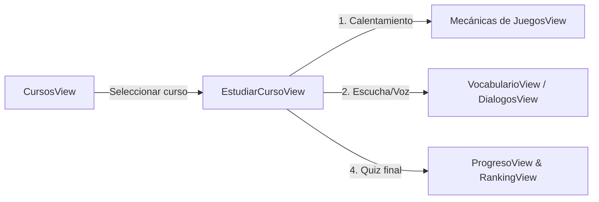

# Módulo 2: Aprendizaje, Estructura Curricular de Cursos y Estudio Inmersivo

Este módulo constituye el núcleo de la experiencia de estudio interactiva del aprendiz y el entorno de diseño pedagógico para los instructores.

---

## 1. Vistas del Módulo

### 1.1 `CursosView.vue` (`/dashboard/cursos`)
- **Propósito**: Catálogo general de cursos clínicos y centro de gestión de estructura de cursos para instructores y administradores.
- **Funcionalidades según Rol**:
  - **Para el Aprendiz**:
    - Visualiza cursos por tarjetas con icono temático (Cardiología, Farmacología, Soporte Vital, etc.).
    - Barra de progreso porcentual dinámica por curso.
    - Contador de estudiantes inscritos y duración estimada.
    - Botón "Continuar" para ingresar a la sala de estudio.
    - Filtros temáticos por especialidad clínica.
  - **Para el Instructor / Administrador**:
    - Botón **"Nuevo Curso"** y opción **"Editar Estructura"** en cada curso.
    - **Modal de Estandarización de Módulos**: Permite organizar actividades en 4 fases pedagógicas obligatorias: *1. Inicio, 2. Estudio, 3. Práctica, 4. Evaluación*.
    - Creación y edición rápida de actividades directamente en la fase deseada con asignación de plantilla interactiva.

### 1.2 `EstudiarCursoView.vue` (`/dashboard/cursos/:courseId`)
- **Propósito**: Aula virtual inmersiva donde el estudiante cursa los contenidos en una secuencia pedagógica estricta de 4 fases bloqueantes.
- **Mecánica de las 4 Fases Pedagógicas**:
  1. **Fase 1: Inicio (Preparación / Calentamiento)**
     - Dinámicas ligeras de activación cognitiva (Crucigrama corto, Sopa de letras o Asociación rápida).
     - Requiere completar el ejercicio para desbloquear la fase siguiente.
  2. **Fase 2: Estudio (Inmersión en Audio y Pronunciación)**
     - Reproducción de frases y audios médicos con transcripción.
     - **Reconocimiento de voz asistido (Web Speech API)**: El estudiante activa el micrófono (`webkitSpeechRecognition`) y pronuncia la frase; la interfaz compara la precisión fonética.
  3. **Fase 3: Práctica (Refuerzo Interactivo)**
     - Ejercicios de asociación (Match de términos clínicos con su definición).
     - Flashcards interactivas de memorización activa.
  4. **Fase 4: Evaluación (Cierre y Certificación)**
     - Cuestionario evaluativo final (Quizzes con respuestas de opción múltiple).
     - Cálculo de nota; si supera el umbral aprobatorio (ej. 80%), el módulo se marca como superado al 100%.
- **Características adicionales**:
  - **Banner de Simulación de Recursos**: Control que simula la caída de servidores de medios para verificar la resiliencia de la interfaz ante fallos de audio o video.
  - **Navegación secuencial con candados**: Pestañas superiores que muestran iconos de candado en fases aún no alcanzadas y marcas de verificación verde en fases aprobadas.

---

## 2. Complementariedad con otras Vistas



1. **`CursosView.vue` ➜ `EstudiarCursoView.vue`**:
   `CursosView` lee el estado acumulado para mostrar el porcentaje de avance general. Al hacer clic en un curso, transfiere el contexto mediante la ruta dinámica `:courseId`.
2. **`EstudiarCursoView.vue` ➜ `VocabularioView.vue` / `DialogosView.vue`**:
   Los contenidos de las fases 2 y 3 (frases de enfermera, diálogos con pacientes) se nutren del vocabulario clínico y las conversaciones médicas estandarizadas.
3. **`EstudiarCursoView.vue` ➜ `ProgresoView.vue`**:
   Al completar las 4 fases de un curso, el progreso del curso se sincroniza para reflejar el 100% en el cuadro de mando del aprendiz.

---

## 3. Manejo de Estado y Persistencia Local

En la versión actual, el avance del estudiante dentro del aula de estudio se almacena en el `localStorage` del navegador bajo la clave:
```javascript
`nursing_academy_progress_${apprenticeId}_course_${courseId}`
```
Estructura del payload persistido:
```json
{
  "phaseProgress": {
    "inicio": 100,
    "estudio": 100,
    "practica": 100,
    "evaluacion": 85
  },
  "currentPhase": "evaluacion",
  "score": 85,
  "completedAt": "2026-09-17T04:15:00.000Z"
}
```

---

## 4. Auditoría Técnica de Backend para este Módulo

| Funcionalidad Frontend | Estado en Frontend | Situación en Backend | Diagnóstico y Acción Requerida |
| :--- | :--- | :--- | :--- |
| **Listado de Cursos en Catálogo** | Objetos JavaScript hardcoded en `CursosView.vue` | No existe modelo `Course` en Prisma ni endpoint `/api/courses`. | ❌ **Sin backend**. Los cursos no se pueden dar de alta ni editar en base de datos. Se requiere modelar la tabla `Course` en PostgreSQL. |
| **Creación/Edición de Actividades en el Curso** | Conectado a `/api/activities` (POST/PUT) | Endpoint `/api/activities` funcional en Express con Prisma. | ✅ **Integrado**. Las actividades creadas dentro del modal sí se guardan en la tabla `Activity`. |
| **Persistencia del Progreso del Módulo** | Exclusivamente en `localStorage` | Inexistente en base de datos. No hay tabla para guardar el avance por fases. | ❌ **Sin backend / Riesgo de pérdida de datos**. Si el estudiante cambia de máquina o limpia cookies, pierde el progreso de su curso. Se requiere crear la tabla `CourseProgress` o `EnrollmentProgress`. |
| **Reconocimiento de Voz y Síntesis** | Implementado nativamente con Web Speech API | Se procesa directamente en el navegador del cliente. | ✅ **Arquitecturalmente correcto para frontend**. No requiere procesamiento en servidor a menos que se quiera transcripción con Whisper. |
| **Simulación de Falla de Medios** | Toggle local en estado reactivo | Funcionalidad puramente cosmética de test. | ℹ️ **No requiere backend**. Mantener para pruebas de resiliencia UI. |
