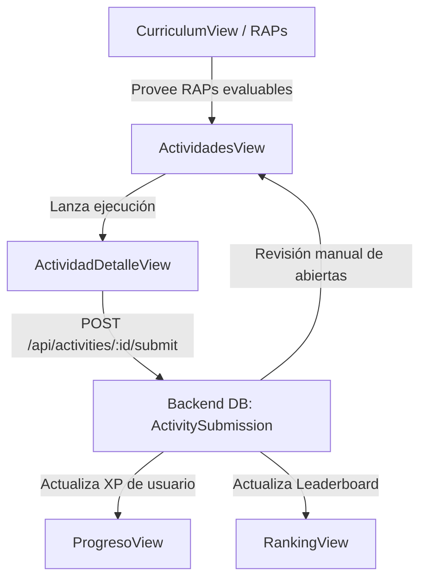

# Módulo 3: Actividades Educativas, Evaluación y Calificación

Este módulo es el motor operativo más robusto de la plataforma. Permite a los instructores diseñar actividades evaluativas a partir de plantillas interactivas y a los aprendices resolverlas con validación automática y retroalimentación en tiempo real.

---

## 1. Vistas del Módulo

### 1.1 `ActividadesView.vue` (`/dashboard/actividades`)
- **Propósito**: Panel central para la creación, listado, filtrado y revisión de tareas y actividades clínicas.
- **Funcionalidades según Rol**:
  - **Para el Aprendiz**:
    - Listado de actividades asignadas con indicador de estado (*Pendiente*, *Aprobada*, *Resuelta*).
    - Píldoras de resumen con conteos totales.
    - Acceso directo mediante el botón **"Iniciar"** hacia la vista de ejecución.
  - **Para el Instructor / Administrador**:
    - **Creador y Editor de Actividades (Modal)**:
      - Asignación a curso y a fase pedagógica (*Inicio, Estudio, Práctica, Evaluación*).
      - Vinculación curricular obligatoria u opcional con un **RAP (Resultado de Aprendizaje)** traído desde la base de datos.
      - Selección de una de las 6 plantillas interactivas disponibles.
      - Configuración de puntaje (XP otorgable) y límite de intentos.
      - Personalización de mensajes de éxito y pistas pedagógicas de ayuda.
    - **Generador de Crucigramas Integrado**:
      - Usa el módulo [src/utils/crosswordGenerator.ts](file:///c:/Users/alejo/Downloads/proyectos-dev/JPEG-EMPRESA/src/utils/crosswordGenerator.ts).
      - Calcula automáticamente intersecciones de letras entre palabras, determina orientaciones (horizontal/vertical) y coordenadas (x, y).
      - Previsualización en tiempo real de la cuadrícula resultante en el propio modal.
    - **Bloqueo Académico de Edición**: Si una actividad ya tiene respuestas enviadas por estudiantes (`hasStudentSubmissions === true`), la vista deshabilita los campos estructurales críticos para preservar la validez de las calificaciones históricas.
    - **Modal de Calificación Manual**: Para cuestionarios que incluyan preguntas de respuesta abierta, el instructor visualiza el texto del alumno y puede cambiar el estado de `pending` a `approved` o `rejected`.
    - **Exportación de Calificaciones a CSV**: Descarga un archivo `.csv` con los nombres, cédulas, notas y fecha de entrega de los aprendices que respondieron la actividad.

### 1.2 `ActividadDetalleView.vue` (`/dashboard/actividades/:activityId`)
- **Propósito**: Entorno ejecutor donde el estudiante interactúa con la mecánica de juego de la actividad y remite su solución.
- **Plantillas y Motores de Juego Soportados**:
  1. **Sopa de Letras (`sopa`)**: Cuadrícula de caracteres donde el usuario selecciona secuencias de letras arrastrando o haciendo clic para encontrar palabras clave del vocabulario médico.
  2. **Crucigrama Clínico (`crucigrama`)**: Renderizado dinámico de casillas numeradas con pistas horizontales y verticales. Control de foco automático hacia la siguiente casilla y resaltado de errores.
  3. **Conexión de Términos (`match`)**: Arrastre de tarjetas de términos clínicos en inglés hacia sus definiciones o imágenes correspondientes en español.
  4. **Cuestionario Quiz / Preguntas Abiertas (`quiz` / `preguntas`)**: Opciones múltiples con selección única o campo de texto libre para elaboración clínica.
  5. **Práctica de Escucha (`listening`)**: Reproducción de audios y frases clínicas mediante síntesis de voz con transcripción y opciones de respuesta.
  6. **Práctica de Pronunciación (`pronunciation`)**: Captura de voz con micrófono utilizando la Web Speech API para evaluar la dicción y fonética del estudiante en términos hospitalarios.
- **Retroalimentación y Estado de Entrega**:
  - Al completar la dinámica, el estudiante presiona **"Entregar Actividad"**.
  - Si la actividad aprueba automáticamente, se muestra el mensaje de felicitación configurado por el instructor y se otorga el XP al perfil del aprendiz.
  - Si queda sujeta a calificación manual, entra en estado de espera con aviso de "Pendiente de revisión por el instructor".

---

## 2. Complementariedad con otras Vistas



1. **`CurriculumView.vue` ➜ `ActividadesView.vue`**:
   Al crear una actividad, el formulario consulta `GET /api/admin/curriculum/raps` para permitir asociar la tarea a una competencia del programa SENA.
2. **`ActividadesView.vue` ➜ `ActividadDetalleView.vue`**:
   `ActividadesView` actúa como índice de tareas pendientes y `ActividadDetalleView` como ejecutor individual por ID.
3. **`ActividadDetalleView.vue` ➜ `ProgresoView.vue` y `RankingView.vue`**:
   Una entrega exitosa impacta en cascada: suma puntos de experiencia en `users.xp`, incrementa el porcentaje en `ProgresoView` y asciende al estudiante en `RankingView`.

---

## 3. Flujo Técnico de Envío y Datos

1. **Llamada de Entrega**:
   ```javascript
   await fetch(`${apiBaseUrl}/api/activities/${activity.value.id}/submit`, {
     method: 'POST',
     headers: { 'Content-Type': 'application/json' },
     body: JSON.stringify({
       apprenticeId: auth.user.id,
       passed: isSuccess,
       answers: JSON.stringify(userAnswers)
     })
   })
   ```
2. **Impacto en Base de Datos**:
   - Se crea o actualiza el registro en `ActivitySubmission` (`activity_id`, `apprentice_id`, `passed`, `review_status`).
   - Si `passed === true`, el backend ejecuta:
     ```typescript
     await prisma.user.update({
       where: { id: apprenticeId },
       data: { xp: { increment: activity.points } }
     })
     ```
   - La actividad pasa su atributo `has_student_submissions` a `true`.

---

## 4. Auditoría Técnica de Backend para este Módulo

| Funcionalidad Frontend | Estado en Frontend | Situación en Backend | Diagnóstico y Acción Requerida |
| :--- | :--- | :--- | :--- |
| **Listar Actividades** | `GET /api/activities` | Endpoint existente y funcional. | ✅ **100% Conectado**. |
| **Obtener Actividad por ID** | `GET /api/activities/:id` | Endpoint existente y funcional. | ✅ **100% Conectado**. |
| **Crear / Editar / Eliminar Actividad** | `POST`, `PUT`, `DELETE /api/activities/:id` | Endpoints existentes y funcionales. | ✅ **100% Conectado**. |
| **Envío de Solución de Aprendiz** | `POST /api/activities/:id/submit` | Endpoint existente, guarda respuestas e incrementa XP. | ✅ **100% Conectado**. |
| **Consultar Entregas del Aprendiz** | `GET /api/activities/my-submissions` | Endpoint existente con filtro por `apprenticeId`. | ✅ **100% Conectado**. |
| **Revisión de Entregas por Instructor** | `PATCH /api/activities/:id/submissions/:apprenticeId/review` | Endpoint existente con actualización de `reviewStatus`. | ✅ **100% Conectado**. |
| **Exportar Entregas a CSV** | `GET /api/activities/:id/submissions/export-csv` | Endpoint existente que genera stream CSV descargable. | ✅ **100% Conectado**. |
| **Generación de Cuadrícula de Crucigrama** | Algoritmo cliente en `crosswordGenerator.ts` | No requiere backend; se procesa en el navegador. | ✅ **Arquitectura óptima**. El layout generado se persiste en los campos de texto de la actividad. |
