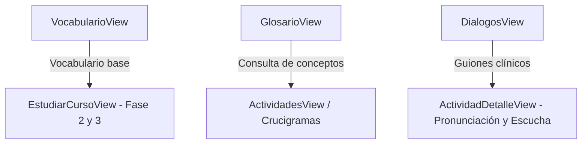

# Módulo 4: Recursos Clínicos, Terminología y Comunicación Médica

Este módulo proporciona el soporte lingüístico y conceptual indispensable para la enfermería bilingüe. Abarca el diccionario de vocabulario técnico, el glosario de términos clínicos y el reproductor de conversaciones estandarizadas hospitalarias.

---

## 1. Vistas del Módulo

### 1.1 `VocabularioView.vue` (`/dashboard/vocabulario`)
- **Propósito**: Repositorio de términos médicos en inglés y español enfocado en enfermería.
- **Funcionalidades**:
  - **Filtro por Categorías**: Botones píldora para filtrar por áreas clínicas (*Cardiología, Farmacología, Anatomía, Cuidados Críticos, Signos Vitales, etc.*).
  - **Buscador en Tiempo Real**: Filtrado reactivo por palabra en inglés, traducción en español o definición.
  - **Ficha de Término**: Muestra el término en inglés, su equivalente en español, la definición contextual y un ejemplo de uso en entorno hospitalario.
  - **CRUD de Contenido (Instructor / Admin)**:
    - Modal de creación y edición de términos (`wordEn`, `wordEs`, `category`, `definition`, `example`).
    - Eliminación directa con confirmación de seguridad.

### 1.2 `GlosarioView.vue` (`/dashboard/glosario`)
- **Propósito**: Enciclopedia clínica de conceptos médicos profundos para consulta rápida de los aprendices.
- **Funcionalidades**:
  - **Navegación Alfabética A-Z**: Botonera con letras del abecedario que permite saltar directamente a los términos que inician con la letra seleccionada, con opción de ver "Todas".
  - **Buscador de Conceptos**: Campo de búsqueda de texto completo sobre términos y descripciones.
  - **Tarjetas Acordeón Desplegables**: Cada término se puede expandir para consultar:
    - Definición formal en español.
    - Conceptos y términos relacionados mediante etiquetas.
    - Contexto clínico aplicado (ejemplos prácticos en guardia de enfermería).

### 1.3 `DialogosView.vue` (`/dashboard/dialogos`)
- **Propósito**: Entrenamiento en comunicación médico-paciente y entre profesionales de la salud en inglés técnico.
- **Funcionalidades**:
  - **Listado y Selección de Conversaciones**: Panel lateral con diálogos ordenados por escenarios clínicos (*Triage, Administración de Medicamentos, Entrega de Turno, Explicación de Procedimientos al Paciente*).
  - **Reproductor Interactivo de Chat**:
    - Distribución tipo burbuja de mensajería distinguiendo hablantes (Enfermera, Paciente, Médico).
    - **Síntesis de Voz Asistida (TTS)**: Botón de audio en cada parlamento para escuchar la pronunciación nativa utilizando la síntesis de voz del navegador (`window.speechSynthesis`).
    - **Conmutador Bilingüe**: Botón "Ocultar/Mostrar Español" que permite al estudiante ocultar las traducciones para forzar la inmersión en inglés o revelarlas si necesita apoyo.
  - **CRUD de Diálogos para Instructores**:
    - Creación y edición de conversaciones con título, descripción y editor dinámico de líneas de parlamento (hablante, frase en inglés, traducción al español).

---

## 2. Complementariedad con otras Vistas



1. **`VocabularioView.vue` ➜ `CursosView.vue` / `EstudiarCursoView.vue`**:
   Las palabras cargadas en el vocabulario alimentan directamente las fases de inmersión y práctica en los cursos temáticos correspondientes.
2. **`DialogosView.vue` ➜ `ActividadDetalleView.vue`**:
   Los diálogos sirven como plantilla auditiva previa para que el alumno complete con éxito las actividades de tipo `listening` y `pronunciation`.
3. **`GlosarioView.vue` ➜ `ActividadesView.vue`**:
   Las definiciones del glosario sirven como pistas y respuestas para las sopas de letras y los crucigramas clínicos.

---

## 3. Manejo Técnico y APIs del Navegador

- **Síntesis de Voz en Diálogos**:
  ```javascript
  function speak(text) {
    if (!('speechSynthesis' in window)) return
    window.speechSynthesis.cancel() // Detiene audios previos
    const utterance = new SpeechSynthesisUtterance(text)
    utterance.lang = 'en-US'
    utterance.rate = 0.9 // Velocidad adaptada para aprendizaje
    window.speechSynthesis.speak(utterance)
  }
  ```

---

## 4. Auditoría Técnica de Backend para este Módulo

| Funcionalidad Frontend | Estado en Frontend | Situación en Backend | Diagnóstico y Acción Requerida |
| :--- | :--- | :--- | :--- |
| **Vocabulario Médico (CRUD)** | Conectado a `/api/content/vocabulary` (GET, POST, PUT, DELETE) | Modelo Prisma `Vocabulary` y controlador en Express totalmente operativos. | ✅ **100% Conectado e integrado en BD**. |
| **Diálogos Clínicos (CRUD)** | Conectado a `/api/content/dialogues` (GET, POST, PUT, DELETE) | Modelo Prisma `Dialogue` y controlador en Express totalmente operativos. | ✅ **100% Conectado e integrado en BD**. |
| **Glosario Clínico** | Array de objetos estáticos hardcoded en `GlosarioView.vue` | **No existe modelo `Glossary` en Prisma ni endpoints `/api/content/glossary`**. | ❌ **Sin backend / Datos locales**. Los términos del glosario no pueden agregarse ni editarse en BD. **Recomendación**: Crear el modelo `GlossaryTerm` en Prisma o unificar el Glosario con la tabla `Vocabulary` mediante un campo `type: 'GLOSSARY' | 'VOCABULARY'`. |
| **Reproducción de Voz TTS** | Implementada nativamente con `window.speechSynthesis` | Ejecución en el navegador cliente. | ✅ **Correcto**. No consume ancho de banda de servidor. |
