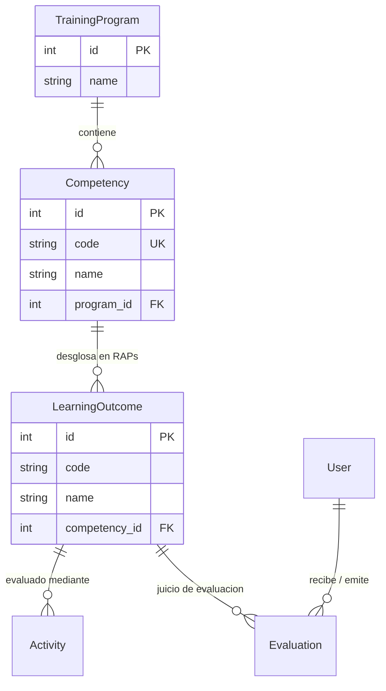

# Módulo 5: Gestión Curricular y Modelo SENA

Este módulo modela la arquitectura pedagógica institucional basada en el esquema de formación por competencias y Resultados de Aprendizaje (RAPs) del Servicio Nacional de Aprendizaje (SENA).

---

## 1. Vista del Módulo

### 1.1 `CurriculumView.vue` (`/dashboard/curriculum`)
- **Propósito**: Panel exclusivo para directivos, administradores e instructores donde se parametrizan los niveles formativos, las competencias normativas y los resultados de aprendizaje observables.
- **Estructura y Pestañas de Navegación**:
  1. **Pestaña 1: Programas de Formación (Niveles)**
     - Listado de programas (ej. *Técnico en Enfermería, Nivel 1 A1, Nivel 2 A2*).
     - Formulario lateral de alta y edición de nombre del programa.
     - Eliminación de programas con verificación de dependencias.
  2. **Pestaña 2: Competencias Curriculares**
     - Cada competencia agrupa un conjunto de saberes y destrezas (código normativo y denominación formal).
     - Selector de filtrado por programa de formación.
     - Asignación obligatoria de la competencia a un programa padre.
     - Conteo visible de RAPs asociados a cada competencia.
  3. **Pestaña 3: Resultados de Aprendizaje (RAPs)**
     - El RAP representa el criterio evaluable específico que el aprendiz debe demostrar.
     - Asignación obligatoria de cada RAP a su competencia correspondiente.
     - Búsqueda y filtrado por competencia para facilitar la auditoría curricular.

---

## 2. Jerarquía del Modelo de Datos (SENA)

El modelo relacional implementado en la base de datos PostgreSQL mediante Prisma respeta la siguiente jerarquía en cascada:

---

## 3. Complementariedad e Integración con el Resto del Sistema

1. **`CurriculumView.vue` ➜ `ActividadesView.vue`**:
   - Toda actividad didáctica creada en la plataforma puede vincularse a un `learningOutcomeId`.
   - Cuando el instructor crea una actividad, el dropdown de RAPs se nutre directamente de los datos parametrizados en `CurriculumView`.
2. **`CurriculumView.vue` ➜ Evaluación de Aprendices (`Evaluation` en BD)**:
   - Los RAPs creados aquí son la base para que el instructor emita juicios de evaluación ("Aprobado" / "No Aprobado") registrados en la tabla `evaluations`.

---

## 4. Auditoría Técnica de Backend para este Módulo

| Entidad Curricular | Operaciones Frontend | Rutas Backend en Express | Estado en BD (Prisma) | Diagnóstico |
| :--- | :--- | :--- | :--- | :--- |
| **Programas de Formación** | Listar, Crear, Editar, Eliminar | `GET, POST, PUT, DELETE /api/admin/curriculum/programs` | Modelo `TrainingProgram` | ✅ **100% Integrado y funcional**. |
| **Competencias** | Listar, Crear, Editar, Eliminar | `GET, POST, PUT, DELETE /api/admin/curriculum/competencies` | Modelo `Competency` | ✅ **100% Integrado y funcional**. |
| **Resultados de Aprendizaje (RAPs)** | Listar, Crear, Editar, Eliminar | `GET, POST, PUT, DELETE /api/admin/curriculum/raps` | Modelo `LearningOutcome` | ✅ **100% Integrado y funcional**. |

> **Nota de Seguridad**: Todas las rutas de este módulo están protegidas por el middleware `authenticate` y el middleware de autorización `requireAdminOrInstructor`. Si un usuario con rol de `APRENDIZ` intenta invocar estas rutas, el servidor deniega el acceso con código HTTP `403 Forbidden`.
