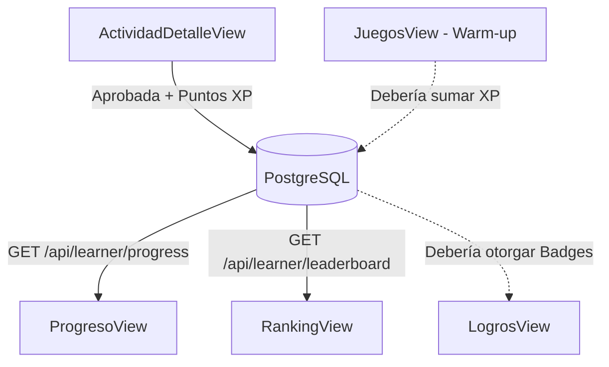

# Módulo 6: Gamificación, Comunidad y Mini-Juegos

Este módulo incrementa el engagement del aprendiz mediante mecánicas lúdicas: acumulación de puntos de experiencia (XP), tablas de clasificación comunitaria, medallas/insignias de logro y mini-juegos de calentamiento rápido.

---

## 1. Vistas del Módulo

### 1.1 `ProgresoView.vue` (`/dashboard/progreso`)
- **Propósito**: Cuadro de mando personal de rendimiento para el aprendiz.
- **Funcionalidades**:
  - **Banner de Progreso General**:
    - Porcentaje total de avance en la academia calculado en base a actividades aprobadas.
    - Contador de actividades aprobadas vs. total asignadas.
    - Medalla con el total de **XP acumulada**.
    - Barra de progreso porcentual general.
  - **Desglose de Progreso por Curso**:
    - Tarjetas para cada curso clínico (*Cardiología, Farmacología, etc.*) con conteo de actividades superadas (`passed/total`) y porcentaje individual.

### 1.2 `RankingView.vue` (`/dashboard/ranking`)
- **Propósito**: Tabla de clasificación comunitaria (Leaderboard) que fomenta la sana competencia entre estudiantes.
- **Funcionalidades**:
  - **Podio Gráfico Top 3**:
    - Diseño escalonado con corona dorada para el puesto #1, puesto #2 y puesto #3 con avatares de iniciales y puntajes XP.
  - **Tabla General Top 10**:
    - Posición numérica, iniciales, nombre completo y total de actividades aprobadas.
    - Resaltado visual especial con borde azul e indicador `(Tú)` en la fila correspondiente al usuario autenticado.

### 1.3 `LogrosView.vue` (`/dashboard/logros`)
- **Propósito**: Vitrina de medallas e insignias que premian hitos formativos específicos.
- **Funcionalidades**:
  - Banner con contador de logros desbloqueados (ej. *7 / 20 desbloqueados*).
  - **Sección Desbloqueados**: Medallas a color con emojis temáticos (*🎯 Primer Paso, 🔥 Estudiante Activo, 🧠 Quiz Master, 👩‍⚕️ Enfermero Pro*) y los puntos de XP que aportaron.
  - **Sección Por Desbloquear**: Medallas en escala de grises con candado, pistas para alcanzarlas (*ej. "Completa 5 cursos avanzados"*) y barras porcentuales de progreso hacia la meta.

### 1.4 `JuegosView.vue` (`/dashboard/juegos`)
- **Propósito**: Hub de juegos rápidos e interactivos para activación mental previa al estudio.
- **Funcionalidades**:
  - **Aviso para Instructores**: Banner informativo de "CRUD de Juegos en Desarrollo".
  - **Para Aprendices - Juego Destacado "Warm-up Drag Match"**:
    - Juego jugable de 4 rondas rápidas de comunicación médica.
    - **Mecánica PointerEvents (Arrastre y Suelta Táctil/Mouse)**:
      - El usuario toma tarjetas clínicas flotantes (ej. *Stethoscope, Blood Pressure, Syringe*), las arrastra por la pantalla con captura de puntero (`setPointerCapture`) y las suelta en la caja contenedora de su expresión en inglés correspondiente.
      - Detección precisa de colisiones mediante `document.elementsFromPoint(dropX, dropY)`.
      - Si la coincidencia es incorrecta o se suelta afuera, la tarjeta regresa automáticamente a su posición inicial con animación suave (`slideBack`).
    - Marcador de rondas (1 a 4), contador de puntos ganados y pantalla final de victoria con confeti visual y botón para reiniciar o volver.
  - **Catálogo de Juegos Adicionales**: Tarjetas de presentación para *Crucigrama Clínico, Speed Trivia, Memory Match y Ruleta de Términos*.

---

## 2. Complementariedad con otras Vistas

1. **`ActividadDetalleView.vue` ➜ `ProgresoView.vue` y `RankingView.vue`**:
   Cada actividad aprobada en `ActividadDetalleView` actualiza de inmediato el registro en base de datos. Al ingresar a `ProgresoView` o `RankingView`, el alumno ve reflejado su progreso real y su nuevo puesto en la tabla comunitaria.
2. **`JuegosView.vue` ➜ `EstudiarCursoView.vue`**:
   El "Warm-up Drag Match" está diseñado como actividad de calentamiento antes de iniciar un módulo extenso de estudio.
3. **`ProgresoView.vue` y `RankingView.vue` ➜ `PerfilView.vue`**:
   Las estadísticas consolidadas de XP y actividades aprobadas se replican en la ficha de perfil del estudiante.

---

## 3. Auditoría Técnica de Backend para este Módulo

| Vista / Funcionalidad | Estado en Frontend | Situación en Backend | Diagnóstico y Acción Requerida |
| :--- | :--- | :--- | :--- |
| **Progreso General y por Curso** | Conectado a `GET /api/learner/progress` | Endpoint funcional que calcula dinámicamente actividades aprobadas sobre la tabla `ActivitySubmission`. | ✅ **100% Conectado y operativo**. |
| **Tabla de Clasificación (Ranking)** | Conectado a `GET /api/learner/leaderboard` | Endpoint funcional que consulta usuarios ordenados por `xp DESC` e identifica al usuario conectado. | ✅ **100% Conectado y operativo**. |
| **Logros e Insignias (`LogrosView.vue`)** | Arrays `unlocked` y `locked` hardcoded en el componente Vue | **Existen los modelos `Badge` y `UserBadge` en Prisma**, pero **no hay rutas Express ni controlador** para consultar ni otorgar insignias. | ⚠️ **Desconexión / Falta Endpoint**. Se requiere crear `GET /api/learner/badges` y una función que asigne badges automáticamente cuando el usuario alcance hitos (ej. 100 XP, 5 actividades). |
| **Mecánica Drag Match de Juegos** | 100% interactivo mediante PointerEvents en el navegador | Estado volátil en variables de Vue (`gamePoints`, `currentRoundIndex`). | ℹ️ **Mecánica frontend excelente**, pero **los puntos ganados no se persisten en BD**. Se recomienda enviar un `POST /api/learner/game-xp` al ganar las 4 rondas para sumar los +100 XP a la cuenta. |
| **CRUD de Juegos para Instructor** | Banner estático "En Desarrollo" | Inexistente en base de datos. | ❌ **Sin backend**. Requiere modelar entidades de mini-juegos si se desea permitir a los profesores crear sus propios desafíos. |
