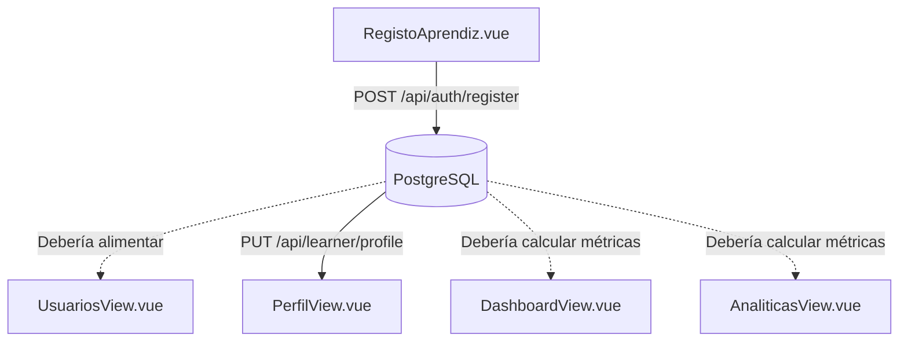

# Módulo 7: Administración, Gestión de Usuarios, Analíticas y Configuración

Este módulo abarca las herramientas de control directivo, administración de cuentas de aprendices e instructores, visualización de métricas de la plataforma, edición del perfil personal y ajustes de preferencias.

---

## 1. Vistas del Módulo

### 1.1 `DashboardView.vue` (`/dashboard/inicio`)
- **Propósito**: Pantalla de bienvenida y resumen de control general tras iniciar sesión.
- **Funcionalidades**:
  - Saludo personalizado con nombre del usuario y etiqueta coloreada según rol (`Admin`, `Instructor`, `Aprendiz`).
  - Tarjetas de KPIs rápidos (Cursos activos, total de usuarios, progreso del mes, ingresos, etc.).
  - Accesos rápidos con iconos a todas las secciones de la plataforma.
  - Lista de actividad reciente (cursos completados, logros desbloqueados, actividades pendientes).
  - Aviso específico para instructores alertando sobre funcionalidades en curso de desarrollo.

### 1.2 `UsuariosView.vue` (`/dashboard/usuarios`)
- **Propósito**: Directorio y control de cuentas de usuarios para administradores.
- **Funcionalidades**:
  - Resumen cuantitativo por rol (Total de usuarios, Administradores, Instructores, Aprendices).
  - Barra de búsqueda por nombre o correo electrónico.
  - Filtro desplegable por rol.
  - Tabla de usuarios con avatar de iniciales, rol, cursos asociados, estado activo/inactivo y último acceso.
  - Acciones por fila: botón para editar y botón para eliminar usuario.
  - Botón **"Nuevo Usuario"** que abre el modal especializado `RegistoAprendiz.vue`.

### 1.3 Componente `RegistoAprendiz.vue` (`src/components/RegistoAprendiz.vue`)
- **Propósito**: Formulario modal de alta de aprendices con rigurosas validaciones de datos:
  - **Tipo de Documento**: Obligatorio (`TI`, `CC`, `CE`).
  - **Documento de Identidad**: Validación numérica estricta entre 6 y 11 dígitos con regex `^\d+$`.
  - **Nombres y Apellidos**: Validación de caracteres alfabéticos (con soporte para tildes y letra ñ) con regex `^[a-zA-ZáéíóúÁÉÍÓÚñÑüÜ\s]+$` para prevenir inyecciones o datos erróneos.
  - **Correo Electrónico**: Validación de estructura RFC formal.
  - **Generación Interna de Contraseña Segura**: Genera una clave aleatoria de 10 caracteres combinando mayúsculas, minúsculas, números y caracteres especiales.
  - Invoca `authStore.register(...)` para registrar formalmente al aprendiz en la base de datos.

### 1.4 `AnaliticasView.vue` (`/dashboard/analiticas`)
- **Propósito**: Inteligencia de negocio y monitoreo del uso de la academia.
- **Funcionalidades**:
  - 4 tarjetas de KPIs globales: Usuarios activos, Total de matriculaciones, Tasa promedio de finalización y Nivel de satisfacción.
  - Gráfico de barras mensual de matriculaciones (Enero a Diciembre).
  - Tabla de tasa de finalización desglosada por curso con barras de progreso codificadas por color (verde ≥70%, amarillo ≥40%, rojo <40%).
  - Botón para exportar métricas.

### 1.5 `PerfilView.vue` (`/dashboard/perfil`)
- **Propósito**: Ficha individual del usuario conectado.
- **Funcionalidades**:
  - Banner con avatar de iniciales, nombre, correo, rol y total de puntos XP.
  - Formulario de información personal: Nombre, Apellido, Correo, Cédula, Rol y tasa de actividades aprobadas.
  - **Modo Edición en Línea**: Permite modificar nombre y apellido, guardando los cambios directamente en el backend mediante `PUT /api/learner/profile`.

### 1.6 `SettingsView.vue` (`/dashboard/settings`)
- **Propósito**: Configuración de preferencias y seguridad del sistema.
- **Funcionalidades divididas en 4 pestañas**:
  - **Notificaciones**: Toggles para activar/desactivar notificaciones por email, avisos de actividades y alertas de ranking.
  - **Apariencia**: Selector de tema (Claro, Oscuro, Sistema) y selector de idioma (Español, English, Português).
  - **Privacidad y Seguridad**: Botones para solicitar cambio de contraseña y activación de autenticación en dos pasos (2FA).
  - **Configuración de Plataforma (Solo Admin)**: Toggles para registro abierto, modo mantenimiento y logs avanzados.

---

## 2. Complementariedad con otras Vistas

1. **`RegistoAprendiz.vue` ➜ `UsuariosView.vue`**:
   Al crear un aprendiz mediante el modal, se espera que el nuevo usuario aparezca listado de inmediato en la tabla de `UsuariosView`.
2. **`PerfilView.vue` ➜ `DashboardLayout.vue`**:
   Al actualizar el nombre o apellido en `PerfilView`, la sesión en `authStore` se sincroniza, actualizando las iniciales y el nombre mostrado en el header y la barra lateral de la aplicación.
3. **`UsuariosView.vue` ➜ `AnaliticasView.vue` y `DashboardView.vue`**:
   Los conteos y demografía de usuarios registrados deberían ser el insumo que nutre las métricas de usuarios activos en `DashboardView` y `AnaliticasView`.

---

## 3. Auditoría Técnica de Backend para este Módulo

Este módulo presenta la mayor cantidad de desconexiones y oportunidades de mejora técnica entre la interfaz y el servidor:

| Vista / Funcionalidad | Estado en Frontend | Situación en Backend | Diagnóstico y Acción Requerida |
| :--- | :--- | :--- | :--- |
| **Listar Usuarios (`UsuariosView.vue`)** | Lee usuarios desde `localStorage` o array `defaultUsers`. | **¡Existe endpoint en backend!** (`GET /api/admin/users` devuelve usuarios de la BD con Prisma). | ⚠️ **Desconexión crítica**. La tabla muestra datos mock. Se debe cambiar la carga inicial para ejecutar `apiFetch('/api/admin/users')`. |
| **Registrar Aprendiz (`RegistoAprendiz.vue`)** | Ejecuta `authStore.register()` con validaciones. | Endpoint `POST /api/auth/register` crea el usuario en la tabla `User` de PostgreSQL. | ✅ **100% Conectado y seguro**. |
| **Eliminar Usuario (`UsuariosView.vue`)** | Elimina únicamente el elemento del array en `localStorage`. | **No existe endpoint `DELETE /api/admin/users/:id`** en Express. | ❌ **Sin backend**. El usuario eliminado sigue existiendo en PostgreSQL. Requiere implementar la ruta DELETE en `admin.routes.ts` y Prisma. |
| **Editar Usuario (`UsuariosView.vue`)** | Botón sin evento `@click`. | No existe endpoint `PUT /api/admin/users/:id`. | ❌ **Sin backend**. Requiere modal y controlador para editar rol o datos de otros usuarios. |
| **Perfil de Usuario (`PerfilView.vue`)** | Conectado a `GET` y `PUT /api/learner/profile`. | Endpoints existentes en `learner.controller.ts` para consultar y actualizar datos propios. | ✅ **100% Conectado y operativo**. |
| **Estadísticas del Dashboard (`DashboardView.vue`)** | 100% estático en array `visibleStats`. | No existe endpoint de agregación `/api/dashboard/stats`. | ❌ **Sin backend**. Los datos mostrados no son reales. Requiere crear un endpoint que compute totales con `prisma.user.count()`, `prisma.activity.count()`, etc. |
| **Historial de Actividad Reciente (`DashboardView.vue`)** | 100% estático en array `recentActivity`. | No existe tabla de auditoría de eventos en Prisma. | ❌ **Sin backend**. Debe crearse un modelo `AuditLog` o consultar las últimas filas de `ActivitySubmission`. |
| **Analíticas y Gráfica (`AnaliticasView.vue`)** | 100% estático en arrays `kpis`, `monthData`, `tableData`. | No existe endpoint de métricas `/api/admin/analytics`. | ❌ **Sin backend**. Requiere servicio de agregación por fecha y curso. |
| **Exportar Analíticas (`AnaliticasView.vue`)** | Botón sin `@click`. | Inexistente. | ❌ **Sin backend**. Requiere función de descarga CSV similar a la de actividades. |
| **Configuración (`SettingsView.vue`)** | Toggles locales y botones sin acción (Cambiar contraseña, 2FA). | Backend tiene `resetPassword`, pero no cambio autenticado ni autenticación 2FA. | ❌ **Sin backend**. Preferencias no se persisten en base de datos. |
