# Arquitectura Modular del Frontend - Nursing Academy (NursePlay)

Esta carpeta contiene la documentación técnica y funcional detallada de todas las vistas, componentes y flujos del frontend del proyecto **Nursing Academy**.

El frontend está desarrollado sobre:
- **Framework**: Vue 3 (Composition API con sintaxis `<script setup>`)
- **Enrutamiento**: Vue Router 4 (HTML5 History Mode con guards de autenticación en `src/router/index.ts`)
- **Estado Global**: Pinia (`useAuthStore`, `useNotificationStore`)
- **Estilos**: TailwindCSS y diseño editorial clínico
- **APIs del Navegador**: Web Speech API (reconocimiento de voz `webkitSpeechRecognition` y síntesis `speechSynthesis`), Pointer Events (arrastre y suelta táctil/mouse) y Web Storage (`localStorage` / `sessionStorage`).

---

## 🗺️ Mapa de Módulos

La aplicación se estructura en 7 módulos funcionales documentados a continuación:

| Módulo | Archivo de Documentación | Vistas Involucradas | Roles Principales |
| :--- | :--- | :--- | :--- |
| **1. Autenticación y Acceso** | [01-autenticacion-y-acceso.md](./01-autenticacion-y-acceso.md) | `Home.vue`, `LoginView.vue`, `RecoverPassword.vue` | Público, Todos |
| **2. Aprendizaje y Cursos** | [02-aprendizaje-y-cursos.md](./02-aprendizaje-y-cursos.md) | `CursosView.vue`, `EstudiarCursoView.vue` | Aprendiz, Instructor, Admin |
| **3. Actividades y Evaluación** | [03-actividades-y-evaluacion.md](./03-actividades-y-evaluacion.md) | `ActividadesView.vue`, `ActividadDetalleView.vue` | Aprendiz, Instructor, Admin |
| **4. Recursos Clínicos y Lenguaje** | [04-recursos-clinicos-y-lenguaje.md](./04-recursos-clinicos-y-lenguaje.md) | `VocabularioView.vue`, `GlosarioView.vue`, `DialogosView.vue` | Todos |
| **5. Gestión Curricular SENA** | [05-curriculum-y-gestion-sena.md](./05-curriculum-y-gestion-sena.md) | `CurriculumView.vue` | Admin, Instructor |
| **6. Gamificación y Juegos** | [06-gamificacion-comunidad-y-juegos.md](./06-gamificacion-comunidad-y-juegos.md) | `ProgresoView.vue`, `RankingView.vue`, `LogrosView.vue`, `JuegosView.vue` | Aprendiz, Todos |
| **7. Administración y Métricas** | [07-administracion-usuarios-y-metricas.md](./07-administracion-usuarios-y-metricas.md) | `DashboardView.vue`, `UsuariosView.vue`, `AnaliticasView.vue`, `PerfilView.vue`, `SettingsView.vue` | Admin, Instructor, Aprendiz |

---

## 🧭 Diagrama de Navegación y Flujo de Estados

```mermaid
graph TD
    Home[Home.vue /] -->|Iniciar Sesión| Login[LoginView.vue /login]
    Login -->|Forgot Password| Recover[RecoverPassword.vue /recover]
    Login -->|JWT Válido| DashboardLayout[DashboardLayout.vue /dashboard/*]

    subgraph "Espacio Privado /dashboard"
        DashboardLayout --> Inicio[DashboardView.vue /inicio]
        DashboardLayout --> Cursos[CursosView.vue /cursos]
        Cursos --> Estudiar[EstudiarCursoView.vue /cursos/:id]
        
        DashboardLayout --> Actividades[ActividadesView.vue /actividades]
        Actividades --> ActDetalle[ActividadDetalleView.vue /actividades/:id]
        
        DashboardLayout --> Vocabulario[VocabularioView.vue /vocabulario]
        DashboardLayout --> Glosario[GlosarioView.vue /glosario]
        DashboardLayout --> Dialogos[DialogosView.vue /dialogos]
        
        DashboardLayout --> Curriculum[CurriculumView.vue /curriculum]
        
        DashboardLayout --> Progreso[ProgresoView.vue /progreso]
        DashboardLayout --> Ranking[RankingView.vue /ranking]
        DashboardLayout --> Logros[LogrosView.vue /logros]
        DashboardLayout --> Juegos[JuegosView.vue /juegos]
        
        DashboardLayout --> Usuarios[UsuariosView.vue /usuarios]
        DashboardLayout --> Analiticas[AnaliticasView.vue /analiticas]
        DashboardLayout --> Perfil[PerfilView.vue /perfil]
        DashboardLayout --> Settings[SettingsView.vue /settings]
    end
```

---

## 🔐 Matriz de Acceso por Roles (RBAC)

La barra de navegación (`src/layouts/DashboardLayout.vue`) adapta dinámicamente sus opciones según el rol del usuario autenticado:

| Ruta | Nombre en Menú | Admin | Instructor | Aprendiz |
| :--- | :--- | :---: | :---: | :---: |
| `/dashboard/inicio` | Dashboard | ✅ | ✅ | ✅ |
| `/dashboard/cursos` | Cursos | ✅ (Estructurar) | ✅ (Estructurar) | ✅ (Estudiar) |
| `/dashboard/actividades` | Actividades | ✅ (CRUD / Revisar) | ✅ (CRUD / Revisar) | ✅ (Resolver) |
| `/dashboard/progreso` | Progreso | ❌ | ❌ | ✅ |
| `/dashboard/vocabulario` | Vocabulario | ✅ (CRUD) | ✅ (CRUD) | ✅ (Consulta) |
| `/dashboard/glosario` | Glosario | ✅ | ✅ | ✅ |
| `/dashboard/dialogos` | Diálogos Clínicos | ✅ (CRUD) | ✅ (CRUD) | ✅ (Práctica) |
| `/dashboard/curriculum` | Gestión Curricular | ✅ | ✅ | ❌ |
| `/dashboard/ranking` | Ranking | ✅ | ❌ | ✅ |
| `/dashboard/logros` | Logros | ✅ | ❌ | ✅ |
| `/dashboard/juegos` | Juegos | ✅ | ✅ (Aviso en desarrollo) | ✅ (Jugable) |
| `/dashboard/analiticas` | Analíticas | ✅ | ❌ | ❌ |
| `/dashboard/usuarios` | Usuarios | ✅ | ❌ | ❌ |
| `/dashboard/perfil` | Perfil | ✅ | ❌ | ✅ |
| `/dashboard/settings` | Configuración | ✅ | ❌ | ✅ |
